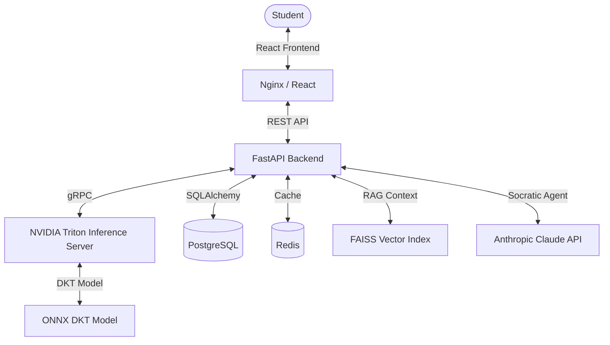

# EduAI — Adaptive Knowledge Tracing & AI Tutoring Platform

## Project Overview
EduAI is an adaptive learning platform that leverages Deep Knowledge Tracing (DKT) to predict student knowledge gaps in real-time. By serving a state-of-the-art DKT model via NVIDIA Triton Inference Server and combining it with a Retrieval-Augmented Generation (RAG) powered AI Tutor (Anthropic Claude), EduAI provides personalized learning experiences and hints based on the student's exact mastery level.

## SDG Alignment
**Sustainable Development Goal 4 (SDG 4): Quality Education**
EduAI directly supports SDG 4 by ensuring inclusive and equitable quality education and promoting lifelong learning opportunities for all. Through adaptive assessment and personalized Socratic tutoring, it democratizes access to expert-level personalized instruction.

## Architecture Diagram


## Prerequisites
- Docker & Docker Compose
- NVIDIA Drivers & NVIDIA Container Toolkit (for Triton GPU support)
- Python 3.11+ (if running scripts directly)

## Quickstart
1. Clone the repository and enter the directory.
2. Ensure you have the `Kaggle` dataset configured or available.
3. Make `setup.sh` executable and run it:
   ```bash
   chmod +x setup.sh
   ./setup.sh
   ```
This script will pre-process the ASSISTments dataset, train the DKT model, export it to ONNX format, and spin up all Docker containers via `docker-compose`.

## API Documentation
Once the backend is running, the auto-generated OpenAPI documentation is available at:
`http://localhost:8080/docs`

## Docker Pull
You can also pull the pre-built images directly from DockerHub (replace with actual username once published):
```bash
docker pull sundaranandhan/eduai-frontend:latest
docker pull sundaranandhan/eduai-backend:latest
```
